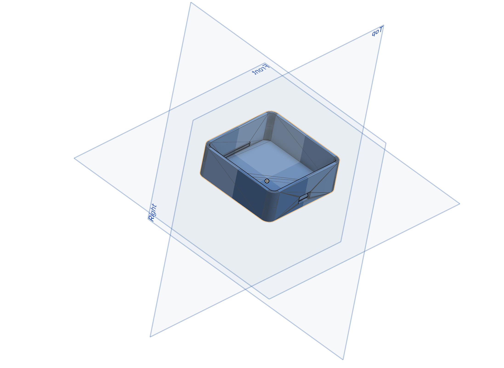

# Roclackter
a knob for doomscrolling
[named like that to go with the this summer's hardware project collection, which includes clackintosh (mech keeb), clackintosh jr. (macropad), clickster (mouse), clackade (a small gameboy kinda stuff)]

## Features
this is quite simple in terms of features. made for doom-scrolling though various websites (like reddit, or instagram).

## Images
### Wiring
![wiring][./images/wiring_diagram.png]

### Case

> assembled version with all electronics could not be made since i could not find the 3d model for the rotary encoder board

> will update more images once it is assembled

## BOM

|S.| Item| Quantity | Price | Link | Notes |
|--|-----|----------|-------|------|-------|
|1.| RaspberryPi Pico | 1 | Rs.426 ($4.88)  | [Amazon.in](https://www.amazon.in/Raspberry-Pi-Headers-Soldered-Micro/dp/B08WPNM7JB?crid=A1SSIU042VXT&dib=eyJ2IjoiMSJ9.Ir7_QZVqM04Ngdpr7LN13VI_a9QkQm2H8yuFxcI4sRZHnMz2Vslbbfug3XagyO4fCLm3Dk0mtUXyizIhKTVj-2zpWhUtqVuSZbACNWi3LWSfiSQNbt-oDGiyoJIcoUe5xQNHJ4oLFKd_M0iXRCUe1aEgIVHOsAESdFqVUB5DhDmzVS74ZKrCEX_KbAQYVlEtGV7nZx3R1uguuVG-WgfGDKTIRRXZJqMtN-8Yxlkt1co.kGc02a58lGaEIH5grEKcsVwy7EKVyJMMXklR1ujk8UE&dib_tag=se&keywords=raspberry+pi+pico&qid=1754057875&sprefix=raspberry+pi+pico,aps,229&sr=8-1) | MCU |
|2.| Ky-040 Roatry Ecoder Module | 1 | Rs.200 ($2.29) | [Amazon.in](https://www.amazon.in/KY-040-Rotary-Encoder-Module-Development/dp/B09RSXGH58?crid=2Q0QW0CCG4XY8&dib=eyJ2IjoiMSJ9.JUeSoxM9Z3In-jAui8EB93vfHjSk8Louc4dovtRlfkGTlwc1--6ZakAjK69s1GFxRC5YTwgCsnIfiYaSz-Qkv3MJt16OyZlsPDW3sgOM38Y7rsZUZgj7mNjOGtVIURmarySLYiIXXgRgSOCkyWsX4KvOAdhgWjZzp5XnCMyXjhmLcwYXND6O5ck7WD-6KJk6nSO3toYNvaIB0Gq1JUyW-A5_ctVbOGxlHquyqnKJTlN01XA00N4yA5AgDf0vJ5Cc_OQituAboPuQmWHa_Dwwgy3_JZtOoww3yhonjnhkE1Q.PUQu4p955Q08EIgTCVzguYZ6Ig5FF1_0wz87HrcgQhI&dib_tag=se&keywords=ec11+rotary+encoder+module&qid=1754058008&sprefix=ec11+rotary+encoder+module,aps,216&sr=8-2&th=1) | ordering from amazon since ordering via other stores would cost more dure to shipping charges|
|3.| Wires for joining stuff (no more wires left after all highway projects) | 1 | Rs.141 ($1.62) | [Amazon.in](https://www.amazon.in/Electronic-Spices-Jumper-Female-Multicolor/dp/B0CPFCRCHB?crid=V04591BSB25S&dib=eyJ2IjoiMSJ9.NpiqG_GJTt7YLKhI8CJEN98liZOBN-BgIiBsM4cnpQ3dzucRzTFScvTNIkGtK4JqEQQj3kj2fwcty79myidDkdyoKA0AKZ6Z-WxJj5UC92LHVgO6nAkAcYLM4JN_8oZQG5Bfhe0UTkHruW0OSBOmo0nZjt67gV91yeTECeFu2Xo-T4t4iZxD_T_0QlE806f2-Xxw8KJ_hv-jZkhcBVpGO5RaVbtvutgUhwDQKksq8k_myCkDsrvusTUaVhHkhzshoNY38Jqf54i8QiX_3ILHSA694BTqWieMpjItGSK57u4.ZKKn73RD3PmdG_sceDpcHuuZavPlY-DzGpyiJnV44FQ&dib_tag=se&keywords=male+to+male+wires&qid=1754058195&sprefix=male+to+male+wires,aps,237&sr=8-9&th=1) | again, from amazon since cheaper wihtout shipping charges |
|4.| Knob for Rotary Encoder | 1 | Rs.258 ($2.96) | [Amazon.in](https://www.amazon.in/Shiva-Enterprises-Knob-Flower-Shaped-Potentiometer/dp/B0CQD169J8?crid=1NGTDRT6QLN2Y&dib=eyJ2IjoiMSJ9.oR8BmxmAM2MO3V2ep9GzaAHXnR71Qek1mB4kDjQZpLQ1xsr-9Mr_z7BEmGqZv0IJ-xBUnCouqBAU6H9VtGRzm_pOCijN9rW5ozXngQ5OFh4o3E3tfAFJm2Dtege2m_95uNOxKLE9iYNN4X5-Z2svw6Sota3lj0KJb5v4NAGoWY3AIGR3cIQIvRRCASXv_8J7pipXyBp_HoAUWdhreAyu_jIsErFrjZ4Au2XqoyxRaxL20iT2lgmmmMe7_o9X1UUW7W2rTL-0K7qF15gufaQy_C3_JZtOoww3yhonjnhkE1Q.JPjp13nqc9mlna8yHShUJMBLPjSwQyTLDSRSWoS4wvc&dib_tag=se&keywords=encoder+knob&qid=1754058443&sprefix=encoder+knob,aps,237&sr=8-2) | 

**Total Cost: Rs.1025 ($11.75)**

> Note: everything is ordered from amazon since the main component - MCU is available on amazon for the cheapest (due to sale). other small components ordered from other retaulers cost wayy more due to shipping charges. this is the lowest possible cost.
> Note: not getting a 3d printed knob since shipping charges (for printing legion) would be higher than the price of this knob.

## Credits:
- made by: [unowen](https://github.com/pari55051)
- inspired by: [Engineer Bo's this YT Video](https://youtu.be/FSy9G6bNuKA?si=tMpBLxpRwd_kkqnn)

